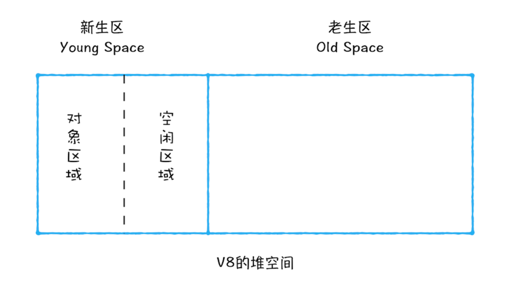
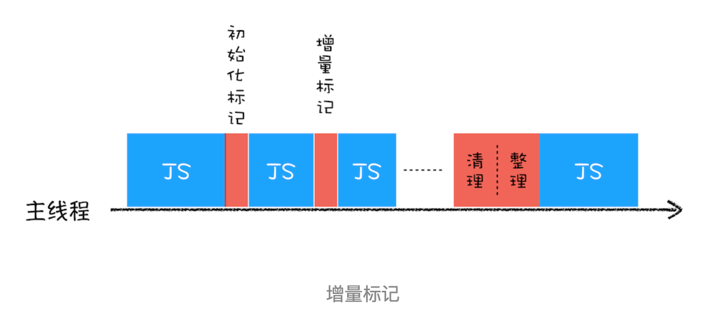

# 垃圾回收

> 以 `Chrome`的 Javascript 引擎 `V8`为例来分析

### 代际假说 (The Generational Hypothesies)

> 垃圾回收的策略是建立在 `代际假说`基础之上的

- 第一个是大部分对象在内存中存在的时间很短，简单来说，就是很多对象一经分配内存，很快就变得不可访问；
- 第二个是不死的对象，会活得更久

### 新生代和老生代

> `V8`把堆分为`新生代`和`老生代`两个区域，新生代存放的是生存时间短的对象，老生代存入生存时间久的对象

> 新生代通常只支持 1~8M 的容量，而老生区支持的容量就大很多了

### 副垃圾回收器和主垃圾回收器

- 副垃圾回收器，主要负责新生代的垃圾回收
- 主垃圾回收器，主要负责老生代的垃圾回收

### 垃圾回收器的工作流程

- 第一步是`标记`空间中活动对象和非活动对象。所谓活动对象就是还在使用的对象，所谓非活动对象就是可以进行垃圾回收的对象
- 第二步`回收`非活动对象所占据的内存。其实就是在所有标记完成后，统一清理内存中所有被标记为可回收的对象
- 第三步是做内存`整理`。一般来说，频繁回收对象后，内存中就会存在大量不连续空间，我们把这些不连续的内存空间称为`内存碎片`，当内存中出现了大量的内存碎片之后，如果需要分配较大连续内存的时候，就有可能出现内存不足的情况。所以最后一步需要整理这些内存碎片，但这步其实是可选的，因为有的垃圾回收器不会产生内存碎片，比如副垃圾回收器。

 

### 副垃圾回收器

- **Scavenge 算法**, 把新生代空间对半划分为两个区域，一个是对象区域，一个是空闲区域

> 因为新生区的空间不大，所以很容易被存活的对象装满整个区域。为了解决这个问题，JavaScript 引擎采用了`对象晋升策略`，也就是经过两次垃圾回收依然还存活的对象，会被移动到老生区中。

### 主垃圾回收器

主垃圾回收器主要负责老生区中的垃圾回收。除了新生区中晋升的对象，一些大的对象会直接被分配到老生区。因此老生区中的对象有两个特点，一个是对象占用空间大，另一个是对象存活时间长。

- **标记-清除(Mark-Sweep)算法**

  - 首先是**标记**过程阶段。标记阶段就是从一组根元素开始，递归遍历这组根元素，在这个遍历过程中，能到达的元素称为**活动对象**，没有到达的元素就可以判断为**垃圾数据**
  - 接下来就是垃圾的**清除**过程

- **标记-整理(Mark-Compact)算法**
  - 这个标记过程仍然与标记 - 清除算法里的是一样的，但后续步骤不是直接对可回收对象进行清理，而是让所有存活的对象都向一端移动，然后直接清理掉端边界以外的内存。

主垃圾回收器执行一次完整的垃圾回收流程如下图所示

**全停顿**: 由于 JavaScript 是运行在主线程之上的，一旦执行垃圾回收算法，都需要将正在执行的 JavaScript 脚本暂停下来，待垃圾回收完毕后再恢复脚本执行。

为了降低老生代的垃圾回收而造成的卡顿，V8 将标记过程分为一个个的子标记过程，同时让垃圾回收标记和 JavaScript 应用逻辑交替进行，直到标记阶段完成，我们把这个算法称为**增量标记（Incremental Marking）算法**。
