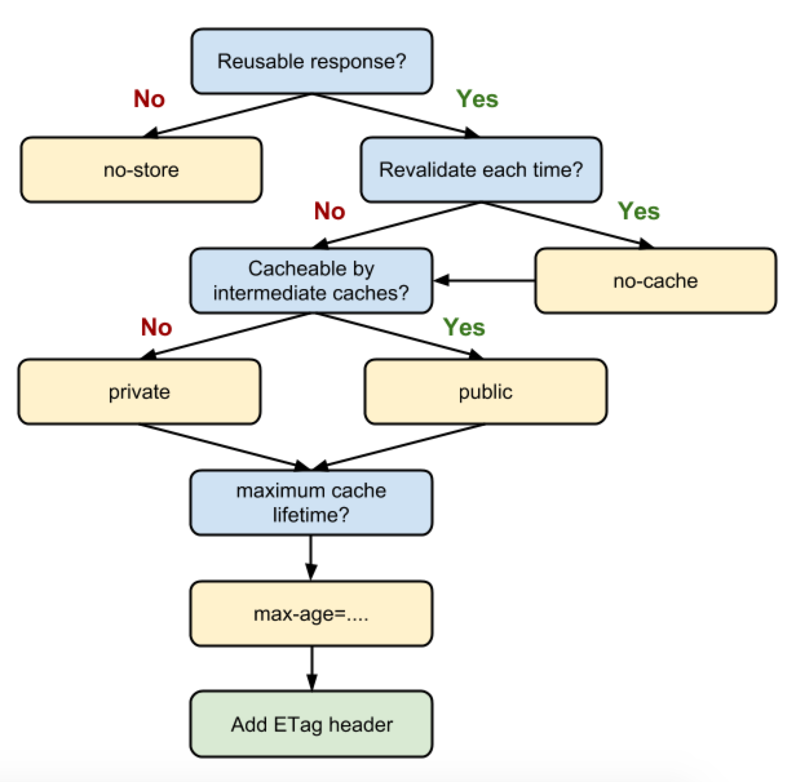

# 浏览器缓存机制

> 1. Memory Cache
> 2. Service Worker Cache
> 3. HTTP Cache
> 4. Push Cache

## HTTP 缓存

### `强缓存`

- `expires`
- `cache-control` （HTTP 1.1)

> `cache-control` 相对于 `expires`更准确，优先级也更高

### `协商缓存`

- `Last-Modified / If-Modified-Since`
- `Etag / If-None-Match`

> `Etag` 在感知文件变化上比 `Last-Modified` 更加准确，优先级也更高。当 `Etag` 和 `Last-Modified` 同时存在时，以 `Etag` 为准

## HTTP 缓存决策指南



> 解读：
>
> 当我们的资源内容不可复用时，直接为 `Cache-Control` 设置 `no-store`，拒绝一切形式的缓存；否则考虑是否每次都需要向服务器进行缓存有效确认，如果需要，那么设 `Cache-Control` 的值为 `no-cache`；否则考虑该资源是否可以被代理服务器缓存，根据其结果决定是设置为 `private` 还是 `public`；然后考虑该资源的过期时间，设置对应的 `max-age` 和 `s-maxage` 值；最后，配置协商缓存需要用到的 `Etag`、`Last-Modified` 等参数。

<br>

## Memory Cache

MemoryCache，是指存在内存中的缓存。从优先级上来说，它是浏览器最先尝试去命中的一种缓存。从效率上来说，它是响应速度最快的一种缓存。

哪些文件会放入内存呢？

资源存不存内存，浏览器秉承的是“节约原则”。我们发现，Base64 格式的图片，几乎永远可以被塞进 memory cache，这可以视作浏览器为节省渲染开销的“自保行为”；此外，体积不大的 JS、CSS 文件，也有较大地被写入内存的几率——相比之下，较大的 JS、CSS 文件就没有这个待遇了，内存资源是有限的，它们往往被直接甩进磁盘。

<br>

## Service Worker Cache

Service Worker 是一种独立于主线程之外的 Javascript 线程。它脱离于浏览器窗体，因此无法直接访问 DOM。这样独立的个性使得 Service Worker 的“个人行为”无法干扰页面的性能，这个“幕后工作者”可以帮我们实现离线缓存、消息推送和网络代理等功能。我们借助 Service worker 实现的离线缓存就称为 Service Worker Cache。

Service Worker 的生命周期包括 install、active、working 三个阶段。一旦 Service Worker 被 install，它将始终存在，只会在 active 与 working 之间切换，除非我们主动终止它。这是它可以用来实现离线存储的重要先决条件。

下面我们就通过实战的方式，一起见识一下 Service Worker 如何为我们实现离线缓存（注意看注释）： 我们首先在入口文件中插入这样一段 JS 代码，用以判断和引入 Service Worker：

```js
window.navigator.serviceWorker
  .register("/test.js")
  .then(function() {
    console.log("注册成功");
  })
  .catch(err => {
    console.error("注册失败");
  });
```

在 test.js 中，我们进行缓存的处理。假设我们需要缓存的文件分别是 test.html,test.css 和 test.js：

```js
// Service Worker会监听 install事件，我们在其对应的回调里可以实现初始化的逻辑
self.addEventListener("install", event => {
  event.waitUntil(
    // 考虑到缓存也需要更新，open内传入的参数为缓存的版本号
    caches.open("test-v1").then(cache => {
      return cache.addAll([
        // 此处传入指定的需缓存的文件名
        "/test.html",
        "/test.css",
        "/test.js"
      ]);
    })
  );
});

// Service Worker会监听所有的网络请求，网络请求的产生触发的是fetch事件，我们可以在其对应的监听函数中实现对请求的拦截，进而判断是否有对应到该请求的缓存，实现从Service Worker中取到缓存的目的
self.addEventListener("fetch", event => {
  event.respondWith(
    // 尝试匹配该请求对应的缓存值
    caches.match(event.request).then(res => {
      // 如果匹配到了，调用Server Worker缓存
      if (res) {
        return res;
      }
      // 如果没匹配到，向服务端发起这个资源请求
      return fetch(event.request).then(response => {
        if (!response || response.status !== 200) {
          return response;
        }
        // 请求成功的话，将请求缓存起来。
        caches.open("test-v1").then(function(cache) {
          cache.put(event.request, response);
        });
        return response.clone();
      });
    })
  );
});
```

<br>

## Push Cache

Push Cache 是指 HTTP2 在 server push 阶段存在的缓存。

Push Cache 的关键特性：

- Push Cache 是缓存的最后一道防线。浏览器只有在 Memory Cache、HTTP Cache 和 Service Worker Cache 均未命中的情况下才会去询问 Push Cache。
- Push Cache 是一种存在于会话阶段的缓存，当 session 终止时，缓存也随之释放。
- 不同的页面只要共享了同一个 HTTP2 连接，那么它们就可以共享同一个 Push Cache。
