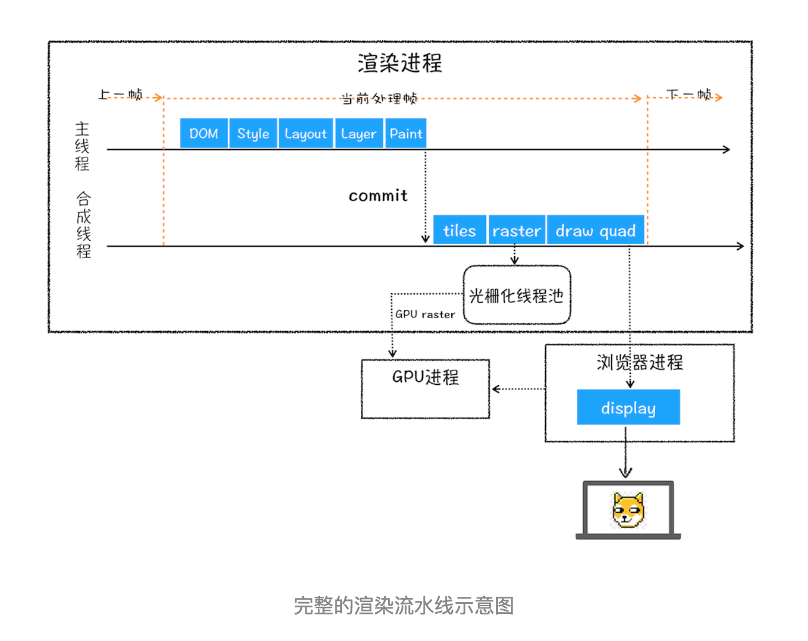

# 渲染流水线

> 由于渲染机制过于复杂，所以渲染模块在执行过程中会被划分成很多子阶段，输入的 HTML 经过这些子阶段，最后输出像素，这样的处理流程叫做**渲染流水线**

> 构建 DOM 树 >> 样式计算 >> 布局阶段 >> 分层 >> 绘制 >> 分块 >> 光栅化 >> 合成

### 构建 DOM 树

**为什么要构建 DOM 树？**

因为浏览器无法直接理解和使用 HTML，所以需要将 HTML 转换成浏览器能够理解的内容——DOM 树

**DOM 构建树过程**

输入 HMTL >> HTML 解析器解析 >> 输出 DOM 树

**HTML 和 DOM 的区别**

DOM 和 HTML 内容几乎是一样的，但是 HTML 不同的是，DOM 是保存在内存中的，可以通过 Javascript 来查询或修改其内容

### 样式计算

- 将 CSS 转换为浏览器能够理解的结构`styleSheets`
- 转换样式表中的属性值，使其标准化
  > 2em 解析成 32px, red 解析成 rgb(255, 0, 0), bold 解析成 700 等等
- 计算出 DOM 树中每个节点的具体样式
  - CSS 的继承规则
  - CSS 的层叠规则

### 布局阶段

> 计算出 DOM 树中可见元素的几何位置,这个计算过程叫做布局

- 创建布局树
- 布局计算

### 分层

通常情况下，**并不是布局树中的每个节点都包含一个图层，如果一个节点没有对应的层，那么这个节点就从属于父节点的图层**。最终每个节点都会直接或间接地从属于一个层。

为特定的节点创建新的层的条件是？

- **_拥有层叠上下文属性的元素会被提升为单独的一层_**
  > 比如 `position: fixed` `z-index: 2` `filter: blur(5px)` `opacity: .5`  
  > 明确定位属性的元素、定义透明属性的元素、使用 CSS 滤镜的元素等，都拥有`层叠上下文属性`
- **_需要裁剪(clip)的地方也会被创建为图层_**
  > 比如超出限定宽高的文字内容

### 图层绘制

- 将图层的绘制拆分成很多小的**绘制指令**
- 然后把这些指令按照顺序组成一个**待绘制列表**

### 栅格化（raster)操作

当图层的绘制列表准备好之后，主线程会把该绘制列表**提交**给合成线程

- 合成线程将图层划分为图块
- 合成线程按照视口附近的图块来优先生成**位图**
  

### 合成和显示

一旦所有图层都被栅格化，合成线程就会生成一个绘制图块的命令——“DrawQuad”，然后将该命令提交给浏览器进程。

浏览器进程里有一个叫 viz 的组件, 用来接收合成线程发过来的 DrawQuad 命令，然后根据 DrawQuad 命令，将其页面内容绘制到内存中，最后再将内存显示在屏幕上。

## 一个完整的渲染流程大致可以总结如下：

1.  渲染进程将 HTML 内容转换为能够读懂的**DOM 树**结构
2.  渲染引擎将 CSS 样式表转换为浏览器可以理解的**styleSheets**，计算出 DOM 节点的样式
3.  创建**布局树**，并计算元素的布局信息
4.  对布局树进行分层，并生成**分层树**
5.  为每个图层生成**绘制列表**, 并将其提交到合成线程
6.  合成线程将图层分成**图块**， 并在**光栅化线程池**中将图块转换成**位图**
7.  合成线程发送绘制图块命令**DrawQuad**给浏览器进程
8.  浏览器进程根据 DrawQuad 消息**生成页面**，并**显示**到显示器上
