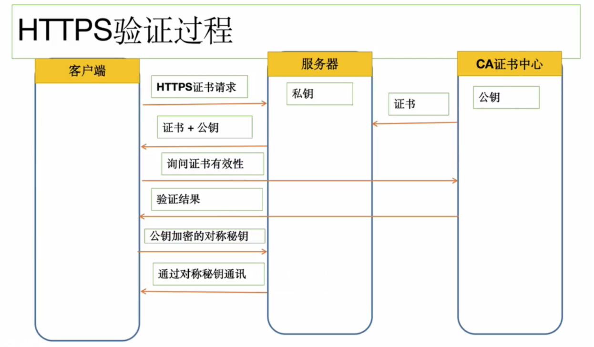

# HTTP

## HTTP 组成

### 1. 请求行

`GET /images/logo.gif HTTP/1.1`

`请求方法 URL 协议版本`

> POST 和 GET 的区别？

- GET 请求能缓存，POST 请求不行
- POST 请求相对 GET 安全一点，因为 GET 请求都包含在 URL 里，且会被浏览器保存历史记录。POST 不会，但是在抓包的情况下都一样
- URL 长度有有限制，会影响 GET 请求，但是这个长度限制是由浏览器规定的
- POST 支持更多的编码类型且不对数据类型限制

### 2. 首部

#### 1）通用首部

#### 2）请求首部

#### 3）实体首部

### 3. 实体

## 常见状态码

### 2XX 成功

- 200 OK, 表示从客户端发来的请求在服务器端被正确处理
- 204 No content, 表示请求成功，但响应的报文不含实体的主体部分
- 205 Reset Content，表示请求成功，但响应报文不含实体的主体部分，但是与 204 响应不同在于要求请求方重置内容
- 206 Partial Content，进行范围请求

### 3XX 重定向

- 301 moved permanently, 永久重定向，表示资源已被分配了新的 URL
- 302 found，临时重定向，表示资源临时被分配了新的 URL
- 303 see other, 表示资源存在另一个 URL, 应使用 GET 方法获取资源
- 304 not modified，表示服务器允许访问资源，但因发生请求未满足条件的情况
- 307 temporary redirect，临时重定向，和 302 含义类似，但是期望客户端保持请求方法不变向新的地址发出请求

### 4XX 客户端错误

- 400 bad request, 请求报文存在语法错误
- 401 unauthorized, 表示发送的请求需要有通过 HTTP 认证的认证信息
- 403 forbidden, 表示对请求资源的访问被服务器拒绝
- 404 not found, 表示在服务器上没有找到请求的资源

### 5XX 服务器错误

- 500 inernal server error, 表示服务器端在执行请求时发生了错误
- 501 not implemented, 表示服务器不支持当前请求所需要的某个功能
- 503 service unavailable, 表示服务器暂时处于超负载或正在停机维护，无法处理请求

# HTTPS

一般来说，主要关注的就是 `SSL/TLS` 的握手流程，如下（简述）：

1. 浏览器请求建立 `SSL` 链接，并向服务端发送一个随机数–`Client random` 和客户端支持的加密方法，比如 RSA 加密，此时是明文传输。
2. 服务端从中选出一组加密算法与 `Hash 算法`，回复一个随机数–`Server random`，并将自己的身份信息以证书的形式发回给浏览器 （证书里包含了网站地址，非对称加密的公钥，以及证书颁发机构等信息）
3. 浏览器收到服务端的证书后

- 验证证书的合法性（颁发机构是否合法，证书中包含的网址是否和正在访问的一样），如果证书信任，则浏览器会显示一个小锁头，否则会有提示
- 用户接收证书后（不管信不信任），浏览会生产新的随机数–`Premaster secret`，然后证书中的公钥以及指定的加密方法加密 `Premastersecret`，发送给服务器。
- 利用 `Client random`、`Server random` 和 `Premaster secret` 通过一定的算法生成 HTTP 链接数据传输的对称加密 key- `session key`
- 使用约定好的 `HASH 算法`计算握手消息，并使用生成的 `session key` 对消息进行加密，最后将之前生成的所有信息发送给服务端。

4. 服务端收到浏览器的回复

- 利用已知的加解密方式与自己的私钥进行解密，获取 `Premastersecret`
- 和浏览器相同规则生成 `session key`
- 使用 `session key` 解密浏览器发来的握手消息，并验证 Hash 是否与浏览器发来的一致
- 使用`session key` 加密一段握手消息，发送给浏览器

5. 浏览器解密并计算握手消息的 HASH，如果与服务端发来的 HASH 一致，此时握手过程结束

之后所有的 https 通信数据将由之前浏览器生成的 session key 并利用对称加密算法进行加密。

### HTTS 缺点

- https 协议会使页面的加载时间延长近 50%。增加 10% ~ 20% 的耗电。
- https 协议的安全是有范围的，在黑客攻击、拒绝服务攻击、服务器劫持等方面几乎起不到什么作用。
- ssl 证书的信用链体系并不安全。特别是在某些国家可以控制 ca 根证书的情况下，中间人攻击一样可行。
- 需要购买费用。
- https 连接服务器端资源占用高，相同负载下会增加带宽和服务器投入成本。
