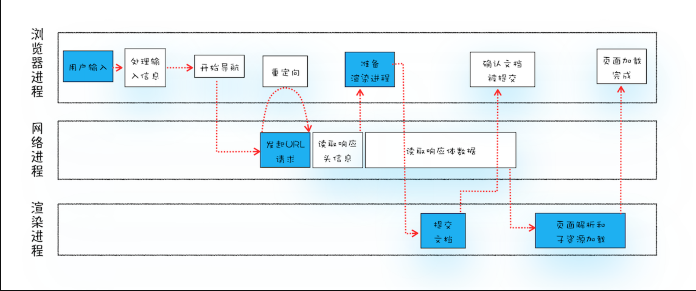

### 从输入 URL 到页面展示完整流程

1、用户输入 url 并按回车键

2、`浏览器进程`检查 url，组装协议，构成完整的 url

3、`浏览器进程`通过进程间通信(IPC)把 url 请求发送给`网络进程`

4、`网络进程`接收到 url 请求后检查本地缓存是否缓存了该请求资源，如果有则将该资源返回给`浏览器进程`

5、如果没有，`网络进程`向`web服务器`发起 http 请求（网络请求），请求流程如下：

- 5.1 进行`DNS解析`，获取服务器 IP 地址、端口（http 端口默认 80，https 默认 443)
- 5.2 利用 ip 地址和服务器建立`TCP连接`
- 5.3 构建请求头信息
- 5.4 发送请求头信息
- 5.5 服务器响应后，`网络进程`接收响应头和响应信息，并解析响应内容

6、`网络进程`解析响应流程：

- 6.1 检查`状态码`，如果是`301/302`,则需要重定向，从`Location`字段中读取地址，重新进行第 4 步。
- 6.2 `200`响应处理:
  - 检查响应类型`Content-Type`，如果是字节流类型，则将该请求提交给`下载管理器`，该导航流程结束，不再进行后续的渲染；如果是`html`则通知`浏览器进程`准备`渲染进程`准备进行渲染

7、准备`渲染进程`:

- 7.1 `浏览器进程`检查当前 url 是否和之前打开的`渲染进程`根域名是否相同，如果相同，则复用原来进程，如果不同，则开启新的`渲染进程`

8、传输数据、更新状态

- 8.1 `渲染进程`准备好后，`浏览器进程`向`渲染进程`发起`"提交文档"`的消息，`渲染进程`接收到消息和`网络进程`建立传输数据的“管道”
- 8.2 `渲染进程`接收完数据后，向`浏览器进程`发送`"确认提交”`
- 8.3 `浏览器进程`接收到确认消息后更新浏览器界面状态：安全、地址栏 url、前进后退的历史状态、更新 web 页面

9、`渲染进程`对文档进行页面解析和子资源加载

- 9.1 `HTML`通过`HTML解析器`转成`DOM Tree`
- 9.2 `CSS`按照`CSS`规则和`CSS解释器`转成`CSSOM Tree`
- 9.3 两个`Tree`结合形成`Render Tree`
- 9.4 通过`Layout`计算出每个元素具体的宽高颜色位置，结合起来，开始绘制，最后显示在屏幕中
